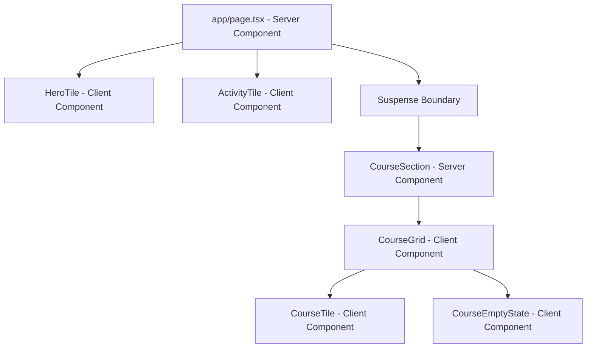

# 🚀 Andaz — Next-Gen Learning Dashboard

Andaz is a high-fidelity, futuristic student dashboard engineered with **Next.js 16 (App Router)**, **Supabase**, **Framer Motion**, and **Tailwind CSS v4**. It features server-rendered database queries, hardware-accelerated animations, granular route streaming, and zero layout shifts.

🌐 **Live Demo:** [next-gen-learning-dashboard-navy.vercel.app](https://next-gen-learning-dashboard-navy.vercel.app/)

---


---

## ✨ Key Features

- 🎛️ **Futuristic Bento Grid Layout** — A responsive dashboard structure featuring dynamic interactive tiles: Hero, Course Tracker, and Analytics heatmap.
- ⚡ **Granular Server-Side Streaming (RSC)** — Securely queries Supabase on the server. The layout employs a granular Suspense boundary so that static parts of the page (Hero & Analytics) render instantly while courses stream in.
- 🌊 **Aesthetic Mesh Gradients & Grain** — Custom high-performance CSS radial mesh gradients combined with an SVG grain noise texture overlay for a premium, tactile feel.
- 🎡 **Conic Border Animations & Glows** — Interactive tiles utilize CSS custom properties (`@property`) to animate gradient borders dynamically on hover.
- 🏎️ **Hardware-Accelerated Spring Animations** — Zero layout shifts using Framer Motion's spring physics (`stiffness: 300`, `damping: 20`) mapped to hardware-accelerated CSS properties.
- ♿ **Adaptive Accessibility & Reduced Motion** — Full integration with standard CSS media queries and Framer Motion's `useReducedMotion` hook to gracefully disable heavy translations and blurs for users who request it.

---

## 🏗 System Architecture

Andaz leverages the power of Next.js 16 Server Components to minimize bundle sizes and separate secure operations from the client-side presentation layer.

### Server & Client Component Boundaries



- **Immediate Render Path**: The main dashboard page (`app/page.tsx`) renders the `<HeroTile />` and `<ActivityTile />` components instantly using mock user parameters and local configuration.
- **Async Streaming Path**: The course repository data is queried inside `<CourseSection />` asynchronously. While the database request resolves, a styled skeleton card state is presented. Once resolved, the HTML structure is streamed into the grid.

### Type-Safe Icon Registry

To avoid runtime lookup errors and maintain complete type safety, icons retrieved from the Supabase database are mapped using a custom registry defined in `lib/icon-registry.tsx`:

```typescript
import { BookOpen, Brain, Code2, Trophy, HelpCircle, LucideIcon } from 'lucide-react';

const iconRegistry: Record<string, LucideIcon> = {
  BookOpen,
  Brain,
  Code2,
  Trophy,
};

export function getIcon(name: string): LucideIcon {
  return iconRegistry[name] ?? HelpCircle;
}
```

---

## 🎨 Premium Styling Secrets

The visual language of Andaz is heavily inspired by design systems like **Linear**, **Vercel**, and **Raycast**, focusing on dark themes, high-contrast typography, and subtle lighting effects.

### 1. Animated Mesh Gradient & Noise Overlay
The background is built dynamically in CSS, shifting smoothly to prevent a static feel:

```css
.mesh-gradient-bg::before {
  content: '';
  position: fixed;
  inset: 0;
  background:
    radial-gradient(ellipse 60% 40% at 10% 20%, rgba(99, 102, 241, 0.08), transparent 60%),
    radial-gradient(ellipse 50% 50% at 90% 80%, rgba(139, 92, 246, 0.06), transparent 60%);
  background-size: 200% 200%;
  animation: gradient-shift 20s ease-in-out infinite;
}
```

A microscopic SVG noise texture overlay is applied with `mix-blend-mode: overlay` to give the surface a tactile grain:

```css
.mesh-gradient-bg::after {
  content: '';
  position: fixed;
  inset: 0;
  opacity: 0.02;
  mix-blend-mode: overlay;
  background-image: url("data:image/svg+xml,%3Csvg viewBox='0 0 512 512' xmlns='http://www.w3.org/2000/svg'%3E%3Cfilter id='noise'%3E%3CfeTurbulence type='fractalNoise' baseFrequency='0.8' numOctaves='4' stitchTiles='stitch'/%3E%3C/filter%3E%3Crect width='100%25' height='100%25' filter='url(%23noise)'/%3E%3C/svg%3E");
}
```

### 2. Conic Gradient Border
To render interactive border glows, Andaz registers a custom `@property` CSS angle to animate borders smoothly:

```css
@property --border-angle {
  syntax: "<angle>";
  initial-value: 0deg;
  inherits: false;
}

.conic-border {
  --border-angle: 0deg;
  border: 1px solid transparent;
  background-origin: border-box;
  background-clip: padding-box, border-box;
  animation: rotate-border 4s linear infinite;
}
```

### 3. Tailwind CSS v4 Configuration
The project is styled using Tailwind CSS v4. Design tokens are injected directly within the `@theme` directive in `app/globals.css`, eliminating the need for a legacy `tailwind.config.js` file:

```css
@import "tailwindcss";

@theme inline {
  --color-background: #09090b;
  --color-foreground: #fafafa;
  --font-sans: var(--font-geist-sans), "Inter", sans-serif;
  --font-mono: var(--font-geist-mono), monospace;
}
```

---

## 🗄 Supabase Database Setup

### 1. Database Schema
Execute the following DDL script within your Supabase project's **SQL Editor** (`supabase.com/dashboard/project/_/sql/new`):

```sql
-- Create the courses table
CREATE TABLE courses (
  id UUID DEFAULT gen_random_uuid() PRIMARY KEY,
  title TEXT NOT NULL,
  progress INTEGER NOT NULL DEFAULT 0 CHECK (progress >= 0 AND progress <= 100),
  icon_name TEXT NOT NULL,
  created_at TIMESTAMPTZ DEFAULT now()
);

-- Seed initial high-quality courses
INSERT INTO courses (title, progress, icon_name) VALUES
  ('Advanced React Patterns', 75, 'BookOpen'),
  ('System Design Fundamentals', 42, 'Brain'),
  ('TypeScript Mastery', 91, 'Code2'),
  ('Data Structures & Algorithms', 28, 'Trophy');
```

### 2. Row Level Security (RLS) configuration
Ensure read access is open to public visitors for this static demonstration:

```sql
ALTER TABLE courses ENABLE ROW LEVEL SECURITY;

CREATE POLICY "Allow public read access" ON courses
  FOR SELECT USING (true);
```

---

## 🚀 Getting Started

### Prerequisites
- **Node.js** 18.17.0 or newer
- **npm** 9.0.0 or newer

### Local Installation

1. **Clone the repository:**
   ```bash
   git clone https://github.com/your-username/andaz.git
   cd andaz
   ```

2. **Install node dependencies:**
   ```bash
   npm install
   ```

3. **Set up local environment environment:**
   Copy the example file to a local environment template:
   ```bash
   cp .env.example .env.local
   ```
   Open the `.env.local` file and replace the variables with your Supabase credentials:
   ```env
   NEXT_PUBLIC_SUPABASE_URL=https://your-project-id.supabase.co
   NEXT_PUBLIC_SUPABASE_ANON_KEY=eyJhbGciOiJIUzI1NiIsInR5cCI6IkpXVCJ9...
   ```

4. **Start the development server:**
   ```bash
   npm run dev
   ```
   Open [http://localhost:3000](http://localhost:3000) on your local browser.

---

## 🌐 Deployment Guidelines

Andaz is optimized for deployment on the **Vercel** platform.

### Step-by-Step Vercel Deployment

1. **Push your code** to a GitHub/GitLab repository.
2. Go to the **Vercel Dashboard** and click **"Add New Project"**.
3. **Import** the repository containing the codebase.
4. **Configure Environment Variables**:
   Add the following keys to your project settings before deploying:
   - `NEXT_PUBLIC_SUPABASE_URL`
   - `NEXT_PUBLIC_SUPABASE_ANON_KEY`
5. **Build Command**: Vercel will auto-detect Next.js and run `npm run build`.
6. Click **Deploy**. Vercel will deploy your site to a globally distributed CDN with full support for Server Components.

---

## 📁 Project Structure

```
andaz/
├── app/
│   ├── globals.css           # Tailwind v4 configuration + base animations
│   ├── layout.tsx            # Root wrapper containing core layouts, fonts
│   ├── page.tsx              # Main dashboard assembly with Suspense blocks
│   ├── loading.tsx           # Route-level loading fallback
│   └── error.tsx             # Error fallback interface with retry capability
│
├── components/
│   ├── dashboard/
│   │   ├── HeroTile.tsx      # Stat counters, weekly goals, and time greetings
│   │   ├── CourseSection.tsx # Server Component wrapping Supabase queries
│   │   ├── CourseGrid.tsx    # Animated Grid featuring staggered card entry
│   │   ├── CourseTile.tsx    # Individual course progress container with glass design
│   │   ├── CourseEmptyState.tsx  # Display shown when course lists are empty
│   │   ├── CourseSkeletons.tsx   # Loading placeholders for streaming sections
│   │   ├── ActivityTile.tsx      # Holds analytics charts
│   │   ├── ContributionHeatmap.tsx # GitHub-style coding calendar
│   │   └── WeeklyBarChart.tsx    # Detailed weekly study hour analysis
│   ├── sidebar/
│   │   ├── Sidebar.tsx       # Sidebar panel containing collapsible nav links
│   │   ├── SidebarItem.tsx   # Side item featuring layoutId indicator
│   │   └── MobileNav.tsx     # Navigation bar optimized for smaller screens
│   └── ui/
│       ├── AnimatedCounter.tsx   # Interactive count-up visualizers
│       ├── ProgressBar.tsx       # Glass-style progress indicators
│       ├── GlowCard.tsx          # Card overlay styling with glow
│       ├── Skeleton.tsx          # Baseline animation skeleton layouts
│       └── WeeklyGoalBar.tsx     # Horizontal progress trackers
│
├── hooks/
│   └── useAnimationConfig.ts # Motion checks & default spring presets
│
├── lib/
│   ├── supabase/
│   │   └── server.ts         # Supabase client instantiation factory
│   ├── icon-registry.tsx     # Mapping logic for Lucide icons
│   ├── constants.ts          # Static parameters & greeting utilities
│   ├── types.ts              # Custom TypeScript typings
│   └── utils.ts              # Tailwind utility merge helpers (cn)
│
├── .env.example              # Template for API credentials
└── package.json              # App configuration, metadata, and dependencies
```

---

## 🧪 Challenges & Solutions

| Challenge | Solution |
| :--- | :--- |
| **Hydration Mismatches in Heatmap** | Generated deterministic heatmap coordinates based on a date-hash seed function (`lib/constants.ts`) instead of using `Math.random()`, ensuring the markup generated on the server matches the client layout exactly. |
| **Next.js 16 Error Boundary API Changes** | Replaced the deprecated `reset` parameter in the Next.js boundary component with React 19's native `unstable_retry` strategy to handle reconnection attempts gracefully. |
| **Reduced Motion Compatibility** | Coupled animations with React states using Framer Motion's `useReducedMotion()` hook. This prevents transitions and translations on elements when the OS preference is set to reduce animation. |
| **RSC & Framer Motion Integration** | Separated the visual entry states (Client Components) from the asynchronous data layer (Server Component). The server fetches array payloads directly, passing them downstream to clients for staggered motion. |

---

## 📦 Technologies Used

| Technology | Version | Purpose |
| :--- | :--- | :--- |
| **Next.js** | `16.2.7` | Production React framework using App Router |
| **React** | `19.2.4` | Component framework supporting React Server Components |
| **Supabase** | `2.107.0` | PostgreSQL BaaS data storage |
| **Framer Motion** | `12.40.0` | Spring-physics micro-interaction and transition engine |
| **Tailwind CSS** | `4.0.0` | High-performance styling configuration |
| **Lucide React** | `1.17.0` | High-fidelity icons |
| **TypeScript** | `5.x` | Strongly typed development |

---

## 📄 License

This project is licensed under the MIT License.
